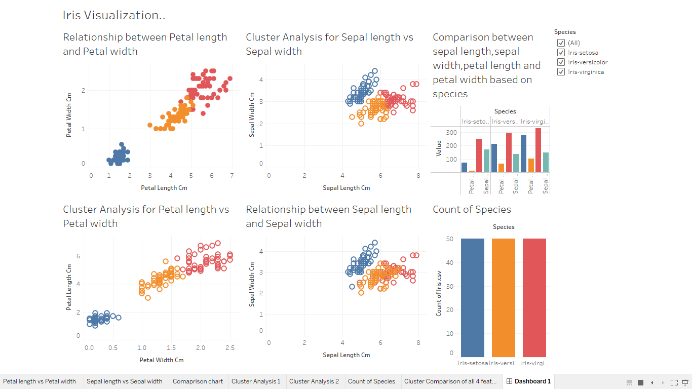

# Tableau Visualization on Iris Flower

### Aim:
To classify the species based on iris flower parameters namely sepal length, sepal width, petal length and petal width.
### Objective:
Given four features i.e. sepal length, sepal width, petal length, petal width and we need to classify the iris into one of the three species- setosa,virginica and versicolor.
### EDA:
- Histogram Plot to check for distribution (univariate analysis).
- Scatter Plot to check for realtionship between two attributes (bivariate analysis).
- Pairplot to check the distribution based on species and also realtion between each attribute.
- Heatmap is performed to check the correlation between each attribute.
- Boxplot to detect outliers in the data.
### Conclusion:
- Each species ( Iris virginica, setosa, versicolor) has 50 as it’s count.
- Sepal Length and Sepal Width features are slightly correlated with each other
#### **Univariate Analysis**
- Iris Setosa species has smaller sepal length but higher width.
- Versicolor lies in almost middle for length as well as width.
- Virginica has larger sepal lengths and smaller sepal width.
- Setosa species have the smallest petal length as well as petal width.
- Versicolor species have average petal length and petal width.
- Virginica species have the highest petal length as well as petal width.
#### **Bivariate Analysis**
- High co relation between petal length and width columns.
- Setosa has both low petal length and width.
- Versicolor has both average petal length and width.
- Virginica has both high petal length and width.
- Sepal width for setosa is high and length is low.
- Versicolor have average values for for sepal dimensions.
- Virginica has small width but large sepal length.
#### **Boxplot Analysis**
- Setosa is having smaller feature and less distributed
- Versicolor is distributed in a average manner and average features.
- Virginica is highly distributed with large no .of values and features.
- Clearly the mean/ median values are being shown by each plots for various features(sepal length & width, petal length & width).
